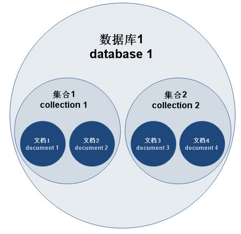
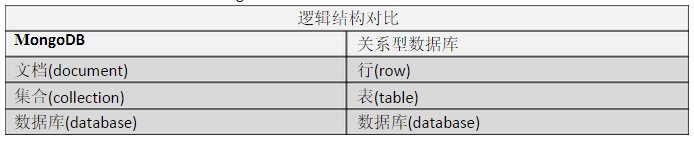
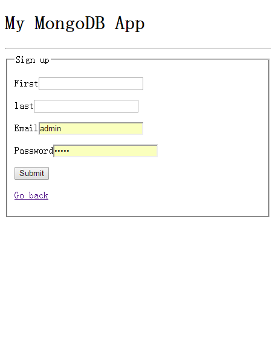
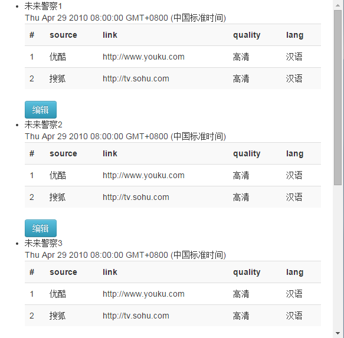

title: Introduction to NodeJS
theme: jdan/cleaver-retro
author:
    name: Yang XU
    url: http://weibo.com/u/1749225714
output: basic.html
controls: true

--
# An Introduction to NodeJS 
## Smashing Node.js, Javascript Everywhere
## 前端人，真会玩  :-)

--
### Basic Introduction
* 安装
* 基本用法
* Node REPL
* NPM

--
### Basic Introduction
Node是JavaScript语言的服务器运行环境:  
* JavaScript语言通过Node在服务器运行，在这个意义上，Node有点像JavaScript虚拟机
* Node提供大量工具库，使得JavaScript语言与操作系统互动（比如读写文件、新建子进程），在这个意义上，Node又是JavaScript的工具库  

安装：访问官方网站nodejs.org了解安装细节。

--
### Node REPL（Read–eval–print loop，"读取-求值-输出"循环）
在命令行键入node命令，后面没有文件名，就进入一个Node.js的REPL环境  
  

--
### NPM - Node包管理器
Node comes with npm installed so you should have a version of npm.  
<pre>
    $npm -v
    2.5.1
</pre>

For more details, please visit https://docs.npmjs.com/

--
### 模块化结构
* NodeJS核心模块
* 自定义模块

--
### 模块化结构
Node.js采用模块化结构，按照CommonJS规范定义和使用模块。模块与文件是一一对应关系，即加载一个模块，实际上就是加载对应的一个模块文件。  
<pre>
    var circle = require('./circle.js');
    // 或者
    var circle = require('./circle');
    var bar = require('bar'); //实际上加载的是./node_modules/bar/lib/bar.js文件
</pre>

--
### NodeJS核心模块
* HTTP: 提供HTTP服务器功能
* URL: 解析URL
* FS(File System): 文件系统交互
* OS(Operation System): 与系统交互
* Events: "发布/订阅"模式（publish/subscribe）的部署
* Query String: 解析URL的查询字符串
* Child Process: 子进程
* Path: 处理文件路径
* Crypto: 提供加密和解密功能，基本上是对OpenSSL的包装

--
### 自定义模块
Node模块采用CommonJS规范。只要符合这个规范，就可以自定义模块。    
<pre>
    // foo.js
    module.exports = function(x) {
        console.log(x);
    };
</pre>
上面代码就是一个模块，它通过module.exports变量，对外输出一个方法。这个模块的使用方法如下。  
<pre>
    // index.js
    var m = require('./foo');
    m("这是自定义模块");
</pre>

--
### 阻塞与非阻塞IO
* 单线程
* 阻塞与非阻塞
* 异常处理

--
### 单线程
  

--
### 阻塞与非阻塞
<pre>
    // PHP
    print('Hello');
    sleep(5);
    print("World");
    print("Bye");
</pre>
PHP中，sleep让程序阻塞一段时间，并且阻塞的时间内，不会有任何操作。

<pre>
    // Node
    console.log('Hello');
    setTimeout(function () {
        console.log('World');
    }, 5000);
    console.log('Bye');
</pre>
Node会先注册事件，随后查询这些事件是否已经发生。当事件发生时，对应的回调函数被触发，然后继续执行下去。如果没有事件触发，则继续执行其他代码，直到有新事件触发。

--
### 异常处理
<pre>
    try {
        setTimeout(function(){
            throw new Error("error");
        },1)
    } catch (err) {
    //can not catch it
        console.log(err);
    }
</pre>
异步方式产生的错误不会被正常捕获(catch),但是会触发<code>uncaughtException</code>事件，可以对这个时间注册回调函数，从而捕获异常。(demo:3-err-handling)  
<pre>
    process.on('uncaughtException', function(err) {
        console.error('Error caught in uncaughtException event:', err);
    });
</pre>

由于异步中的异常无法被外部捕获，所以异常应该作为第一个参数传递给回调函数，Node的编码规则就是这么规定的。  
<pre>
    fs.readFile('/test.txt', function (err, data) {
        if (err) throw err;
        console.log(data);
    });
</pre>

还可以使用Domain

--
### FS模块
Note: fs模块是唯一一个同时提供同步和异步API的模块。
<pre>
    var fs = require('fs');
    // 同步模式
    console.log(fs.readdirSync('.'));
    // 异步模式
    fs.readdir('.', function (err, result) {
        console.log(result);
    });
</pre>

--
### Stream(流)
读写数据有两种方式。一种方式是同步处理，即先将数据全部读入内存，然后处理。它的优点是符合直觉，流程非常自然，缺点是如果遇到大文件，要花很长时间，可能要过很久才能进入数据处理的步骤。另一种方式就是Stream方式，它是系统读取外部数据实际上的方式，即每次只读入数据的一小块，像“流水”一样。所以，Stream方式就是每当系统读入了一小块数据，就会触发一个事件，发出“新数据块”的信号，只要监听这个事件，就能掌握进展，做出相应处理，这样就提高了程序的性能。  

Stream接口最大特点就是通过事件通信，具有readable、writable、drain、data、end、close等事件，既可以读取数据，也可以写入数据。读写数据时，每读入（或写入）一段数据，就会触发一次data事件，全部读取（或写入）完毕，触发end事件。如果发生错误，则触发error事件。  

--
### Stream(流)
Node内部很多涉及IO处理的对象，都部署了Stream接口，比如HTTP连接、文件读写、标准输入输出等。以下这些输入输出操作，提供的都是Stream接口。  
* http responses, on the client
* http requests, on the server
* fs read streams
* zlib streams
* crypto streams
* tcp sockets
* child process  

process全局对象中包含了三种流对象，分别对应Unix三个标准流：  
* stdin: 标准输入
* stdout: 标准输出
* stderr: 标准错误

数据流通过pipe方法，可以方便地导向其他具有Stream接口的对象。  
<pre>
  var fs = require('fs');
  var zlib = require('zlib');

  fs.createReadStream('wow.txt')    //打开文本文件
    .pipe(zlib.createGzip())        //压缩
    .pipe(process.stdout);          //导向标准输出
</pre>

更多流的操作，可以查看 http://javascript.ruanyifeng.com/nodejs/stream.html
--
### File-explorer
demo: 5-file-explorer

--
### TCP
温故而知新：  
  
TCP(传输控制协议)是一个面向连接的协议，保证了两台计算机之间数据传输的可靠性和顺序。  

--
### 一个简易的Telnet聊天室
demo：6-tpc-chat
  
  

--
### HTTP
* HTTP结构
* 简单的Web服务器
* superagent

--
### HTTP结构
HTTP协议构建在请求和响应的概念上，对应在NodeJS中就是由http.ServerRequest和http.ServerResponse这而两个构造器构造出来的对象上。  

* 创建一个HTTP服务器  
<pre>
    var http = require('http');
    http.createServer(function (req, res) {
        res.writeHead(200);
        res.end('Hello World');
    }).listen(3000);
</pre>
* 响应内容如下  
<pre>
    HTTP/1.1 200 OK
    Connection: keep-alive
    Transfer-Encoding: chunked

    Hello World
</pre>
* 头信息 在请求和响应消息前使用头信息(header)来描述不同的消息内容。
Web页面会分发许多不同类型的内容：TEXT, HTML, XML, JSON, PNG, JPEG等。试试修改头信息，效果
<pre>
    http.createServer(function (req, res) {
        res.writeHead(200, {'Content-Type': 'text/html'});
        res.end('Hello < b >World< /b >');
    }).listen(3000);
</pre>

--
### 一个简单的HTTP服务器
demo：7-http-form

--
### Connect
Connect is an extensible HTTP server framework for node using "plugins" known as middleware(中间件).  

Connect 是Node.js中的一个模块，可以用来创建中间件的一个框架，它自身已经包装了Node的HTTP模块的Server以及Server的req和res的对象。

--
### 通过Connect实现一个简单的网站
网站常见的任务:  
* 托管静态文件
* 处理错误以及损坏或者不存在的URL
* 处理不同类型的请求

基于HTTP模块API之上的Connect，提供了一些工具和方法能够让这些重复性的处理便于实现，开发者可以更好专注于应用本身。Don't Repeat Yourself！  
demo: http vs connect, /8-connect-middleware/http-server.js vs /8-connect-middleware/connect.js

--
### Middleware(中间件)
Middleware is a function with access to the request object (req), the response object (res), and the next middleware in line in the request-response cycle of an Express application, commonly denoted by a variable named next. Middleware can:  

* Execute any code.
* Make changes to the request and the response objects.
* End the request-response cycle.
* Call the next middleware in the stack.  

If the current middleware does not end the request-response cycle, it must call next() to pass control to the next middleware, otherwise the request will be left hanging.  

With an optional mount path, middleware can be loaded at the application level or at the router level. Also, a series of middleware functions can be loaded together, creating a sub-stack of the middleware system at a mount point.  

demo: write a middleware(请求时间过长提醒)  
middleware: /8-connect-middleware/request-time.js  
server: /8-connect-middleware/request-time-server.js

--
### 中间件组合使用
* serve-static: 挂载, 将任意URL匹配到文件系统中的任意目录
* morgan: logger, 将请求和响应信息打印在终端
* body-parser: 请求解析, json and urlencoded
* cookie-parser: 读写cookie
* express-session: 管理会话

demo: 登陆验证 /8-connect-middleware/auth-server.js  
  

--
### Express(4.0)
基于 Node.js 平台的快速、灵活、简洁的 web 开发框架。  

* Web应用: Express 是一个简洁、灵活的 Node.js Web 应用开发框架, 它提供一系列健壮的特性，帮助你创建各种 Web 和移动设备应用。
* API: 丰富的 HTTP 快捷方法随你信手拈来，让你创建健壮的 API 变得既快速又简单。
* 性能: Express 不对 Node 已有的特性进行二次抽象，只是在它之上扩展了 Web 应用所需的基本功能。

The main changes in Express 4 are:  
* Changes to Express core and middleware system: The dependency on Connect and built-in middleware were removed, so you must add middleware yourself.
* Changes to the routing system.
* Various other changes. 

--
### Express Web应用
* 创建
* 设置
* 模板引擎
* 路由
* 中间件

demo: 9-express-youku  

--
### WebSocket & Socket.IO
* HTML5 WebSocket
* Socket.IO

--
### HTML5 WebSocket
谈到Web实时推送，就不得不说WebSocket。在WebSocket出现之前，很多网站为了实现实时推送技术，通常采用的方案是轮询 (Polling)和Comet技术，Comet又可细分为两种实现方式，一种是长轮询机制，一种称为流技术，这两种方式实际上是对轮询技术的改进，这些 方案带来很明显的缺点，需要由浏览器对服务器发出HTTP request，大量消耗服务器带宽和资源。面对这种状况，HTML5定义了WebSocket协议，能更好的节省服务器资源和带宽并实现真正意义上的实 时推送。  

WebSocket协议本质上是一个基于TCP的协议，它由通信协议和编程API组成，WebSocket能够在浏览器和服务器之间建立双向连接， 以基于事件的方式，赋予浏览器实时通信能力。既然是双向通信，就意味着服务器端和客户端可以同时发送并响应请求，而不再像HTTP的请求和响应。  

--
### WebSocket Echo Server
Client Code:  
<pre>
  var ws = new WebSocket('ws://host/path')
  ws.onopen = function () {
    ws.send('data');
  }
  ws.onclose = function () {}
  ws.ondata = function (ev) {
    console.log(ev.data);
  }
</pre>

Server Code:  
<pre>
  ws.on('connection', function (socket) {
    socket.on('message', function (msg) {
        console.log(msg);
        socket.send('data');
    });
});
</pre>

Demo: 10-web-socket  

Can I Use Websocket:  
  

--
### Socket.IO
Socket.IO是一个开源的WebSocket库，它通过Node.js实现WebSocket服务端，同时也提供客户端JS库。Socket.IO支持以事件为基础的实时双向通讯，它可以工作在任何平台、浏览器或移动设备。  

Socket.IO支持4种协议：WebSocket、htmlfile、xhr-polling、jsonp-polling，它会自动根据浏览器选择适合的通讯方式，从而让开发者可以聚焦到功能的实现而不是平台的兼容性(Socket.IO 可以在绝大部分的浏览器和设备上运行，从IE6到iOS都支持)，同时Socket.IO具有不错的稳定性和性能。  

* 超时重连
* 支持JOSN数据收发
* 利用命名空间来将消息进行区分

--
### Socket.IO Chat Room
Demo: 11-socket-io
  

--
### MongoDB
* MongoDB
* Mongoose

--
### NoSQL
NoSQL(Not Only SQL), 非关系型数据库
* 可以处理超大量的数据
* 可以运行在便宜的PC服务器集群上
* 高可扩展性和高可用性

--
### MongoDB
MongoDB是一个面向文档，schema无关(schema-less)的数据库，非常适合于Nodejs应用。

  
  
* 文档(document),相当于关系数据库中的一行记录
* 多个文档组成一个集合(collection),相当于关系数据的表
* 多个集合(collection)，逻辑上组织在一起，就是数据库(database)
* 一个MongoDB实例支持多个数据库(database)

--
### MongoDB  Demo
demo (mongodb): 12-mongodb-auth  
  
demo (usage of mongoose): 12-mongodb-mongoose  
  

--
### MySQL
MySQL是一个关系型数据库管理系统，由瑞典 MySQL AB 公司开发，目前属于 Oracle 旗下公司。由于MySQL是开放源码软件，因此可以大大降低总体拥有成本。  

Linux作为操作系统，Apache和 Nginx作为 Web 服务器，MySQL 作为数据库，PHP/Perl/Python作为服务器端脚本解释器。由于这四个软件都是免费或开放源码软件（FLOSS)，因此使用这种方式不用花一分钱（除开人工成本）就可以建立起一个稳定、免费的网站系统，被业界称为“LAMP“或“LNMP”组合。  

通过node-mysql, 可以使用nodejs来写SQL查询语句来操作mysql。  

同时可以使用Sequelize来操作MySQL，使得数据关系、数据处理变得更加容易。  

--
### MySQL Demo
demo (mysql): 13-mysql-shopping-cart  
  
demo (usage of sequelize): 13-mysql-todo-list  
  

